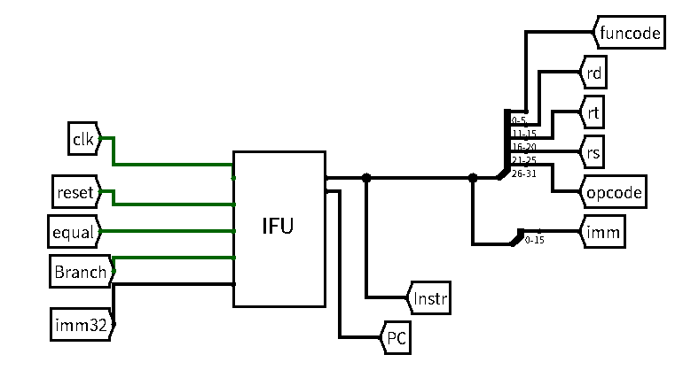
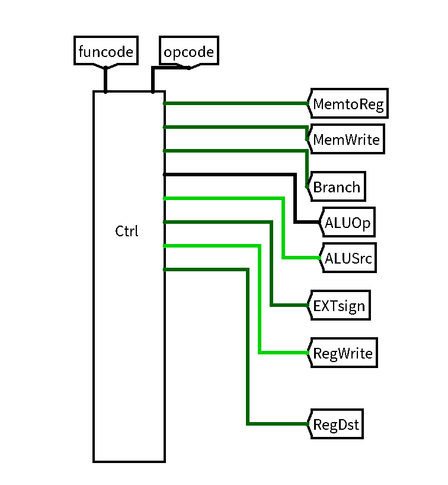
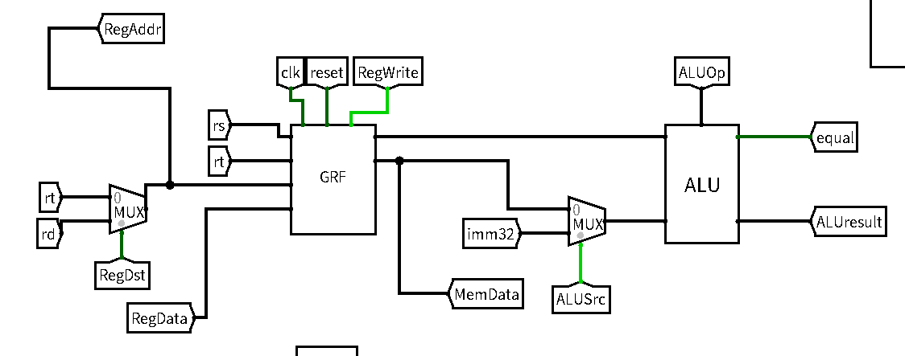
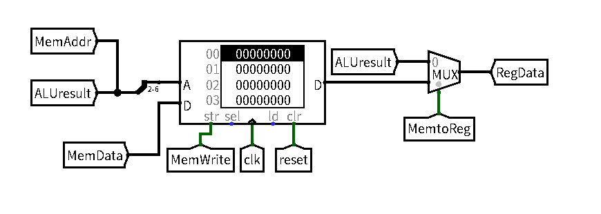
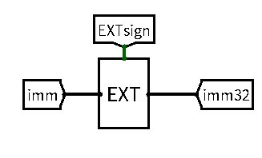

# 单周期CPU设计文档

## 待施工

- lb、lh、sb、sh
- jal、j、 jr、jalr
- bgezal、bltzal
- movn(movz)、srav(sra)
- 测试方案
- 自动化

## 关键模块定义

### IFU

| 序号 | 信号名      | 方向 | 描述                                                         |
| ---- | ----------- | ---- | ------------------------------------------------------------ |
| 1    | clk         | I    | 时钟信号                                                     |
| 2    | reset       | I    | 异步复位信号，将PC值置为**0x00003000** 高电平有效        |
| 3    | equal       | I    | A1(rs)、A2(rt)对应GRF寄存器中的值是否相等  1：相等  0：不相等 |
| 4    | Branch      | I    | 是否为beq信号  0：否  1：是                          |
| 5    | imm32[31:0] | I    | 0-15位immediate的32位**符号扩展 **（beq）                    |
| 6    | Instr[31:0] | I    | IM中指令信号                                                 |
| 7    | PC[31:0]    | O    | 程序计数器信号                                               |

### Controller

| 序号 | 信号名       | 方向 | 描述                                                         |
| ---- | ------------ | ---- | ------------------------------------------------------------ |
| 1    | funcode[5:0] | I    | instr[0:5]6位控制信号                                        |
| 2    | opcode[5:0]  | I    | instr[31:26]6位控制信号                                      |
| 3    | MemtoReg     | O    | 写入GRF的数据的选择信号：  0：MemAddr / ALUresult   1：DmData |
| 4    | MemWrite     | O    | DM的写入使能信号  0：禁止  1：允许                   |
| 5    | Branch       | O    | 是否为beq信号  0：否  1：是                          |
| 6    | ALUOp[2:0]   | O    | ALU控制信号 000：无符号加 001：无符号减 010：或立即数 011：lui |
| 7    | ALUSrc       | O    | 参与ALU运算的第二个数 0：MemData 1：imm32            |
| 8    | Extsign      | O    | imm16无符号或符号扩展的选择信号 0：无符号扩展 1：符号扩展 |
| 9    | RegWrite     | O    | GRF写使能信号 0:不能向GRF 中写入数据 1:能向GRF 中写入数据 |
| 10   | RegDst       | O    | GRF写入地址选择信号 0：rt 1：rd                      |

### GRF

| 序号 | 信号名       | 方向 | 描述                                                         |
| ---- | ------------ | ---- | ------------------------------------------------------------ |
| 1    | clk          | I    | 时钟信号                                                     |
| 2    | reset        | I    | 异步复位信号，将PC值置为**0x00003000**；高电平有效           |
| 3    | WE(RegWrite) | I    | 写使能信号 1:可向 GRF 中写入数据 0:不能向GRF 中写入数据 |
| 4    | A1[4:0]      | I    | rs对应寄存器                                                 |
| 5    | A2[4:0]      | I    | rt对应寄存器                                                 |
| 6    | A3[4:0]      | I    | GRF写入地址选择信号: RegDst决定: 1:rd对应寄存器 0:rt对应寄存器 |
| 7    | WD[31:0]     | O    | RegData 32位数据输入信号                                 |
| 8    | RD1[31:0]    | O    | （GRF[rs]） 输出A1指定的寄存器中的32位数据               |
| 9    | RD2[31:0]    | O    | MemData（GRF[rt]） 输出A2指定的寄存器中的32位数据        |

### ALU

| 序号 | 信号名          | 方向 | 描述                                                         |
| ---- | --------------- | ---- | ------------------------------------------------------------ |
| 1    | A[31:0]         | I    | RD1 参与运算的第一个数                                   |
| 2    | B[31:0]         | I    | ALUSrc： 0：MemData 1：imm32 参与运算的第二个数  |
| 3    | ALUOp[2:0]      | I    | 000：无符号加 001：无符号减 010：或立即数 011：lui |
| 4    | equal           | O    | A与B是否相等 0：不相等 1：相等                       |
| 5    | ALUresult[31:0] | O    | MemAddr A与B做运算后的结果                               |

### DM

| 序号 | 信号名        | 方向 | 描述                                                         |
| ---- | ------------- | ---- | ------------------------------------------------------------ |
| 1    | clk           | I    | 时钟信号                                                     |
| 2    | reset         | I    | 异步复位到0 高电平有效                                   |
| 3    | WE            | I    | MemWrite 写使能信号 0：禁止 1：允许              |
| 4    | A[4:0]        | I    | MemAddr / ALUresult的[6:2] 读取或写入信号地址            |
| 5    | WD[31:0]      | I    | MemData                                                      |
| 6    | MemtoReg      | I    | 写入GRF的数据的选择信号：  0：MemAddr / ALUresult   1：DmData |
| 7    | RD[31:0]      | O    | DmData                                                       |
| 8    | RegData[31:0] | O    | 写入GRF的数据                                                |

### EXT

| 序号 | 信号名      | 方向 | 描述                                                         |
| ---- | ----------- | ---- | ------------------------------------------------------------ |
| 1    | imm[15:0]   | I    | 原16位的立即数信号                                           |
| 2    | EXTsign     | I    | 无符号或符号扩展的选择信号 0：无符号扩展 1：符号扩展 |
| 3    | imm32[31:0] | O    | 扩展后的32位的立即数信号                                     |

## 测试方案

**ROM一定要先清空再导入！！！！！！！！！！**

## 思考题汇总

1. **上面我们介绍了通过 FSM 理解单周期 CPU 的基本方法。请大家指出单周期 CPU 所用到的模块中，哪些发挥状态存储功能，哪些发挥状态转移功能。**

   状态存储功能模块：GRF、DM

   状态转移功能模块：IFU、EXT、ALU、Controller

2. **现在我们的模块中 IM 使用 ROM， DM 使用 RAM， GRF 使用 Register，这种做法合理吗？ 请给出分析，若有改进意见也请一并给出。**

   合理

   IM只需被读取，ROM只有读取功能，存储的数据固定不变，即使断电也能够保留数据，虽然ROM 内部的起始地址是从 0 开始的，但我们可以人工将PC 中储存的地址同 IM 联系起来

   DM一个周期只会进行读取和写入操作之一，RAM的双端口模式可以分别读写，速度快，还可以进行异步复位

   GRF通用寄存器组用32个寄存器很合理

   无改进意见

3. **在上述提示的模块之外，你是否在实际实现时设计了其他的模块？如果是的话，请给出介绍和设计的思路。**

   目前没有。

   但可能：

   把IFU拆出计算PC'的模块？（如果添加新跳转指令）

4. **事实上，实现 `nop` 空指令，我们并不需要将它加入控制信号真值表，为什么？**

   因为nop指令只进行PC=PC+4，控制信号都取0，对其他部分没有影响，所以不需要将它加入控制信号真值表

5. **阅读 Pre 的 [“MIPS 指令集及汇编语言”](http://cscore.buaa.edu.cn/tutorial/mips/mips-6/mips6-1/) 一节中给出的测试样例，评价其强度（可从各个指令的覆盖情况，单一指令各种行为的覆盖情况等方面分析），并指出具体的不足之处。**

   - 各个指令的覆盖情况：没有覆盖nop、sub
- 单一指令各种行为的覆盖情况：

beq：

- 跳转，且目标在此跳转指令之前（未覆盖）
- 跳转，且目标是此跳转指令（未覆盖）
- 跳转，且目标在此跳转指令之后（覆盖）
- 不跳转，且目标在此跳转指令之前（未覆盖）
- 不跳转，且目标是此跳转指令（未覆盖）
- 不跳转，且目标在此跳转指令之后（覆盖）

计算类指令功能测试

- 寄存器数据方面，可以考虑以下情况：
  - 0 及附近的数：−2,−1,0,1,2
  - 32 位数边界附近的数： −2147483648,−2147483647,2147483646,2147483647(未覆盖）
  - 32 位数范围内的一些随机数：−1000786109,1919156834,...
- 无符号立即数方面，可以考虑以下情况：
  - 0 及附近的数：0,1,2,3
  - 16 位无符号数边界附近的数：65533,65534,65535（未覆盖）
  - 16 位无符号数范围内的一些随机数：25779,42528,...
- 特别的，可注意测试目标寄存器是 $0$0 的情况。（未覆盖）

存取类指令功能测试

- offset 方面，可以考虑以下情况：
  - offset 是正数
  - offset 是零
  - offset 是负数（未覆盖）
- $base寄存器方面，可以考虑以下情况：
  - `$base` 寄存器中的值是正数（未覆盖）
  - `$base` 寄存器中的值是零
  - `$base` 寄存器中的值是负数（未覆盖）
- 特别的，对于 `sw` 指令，建议存入的 word 中，每个 byte 都不是零。
- 特别的，对于 `lw` 指令，可注意测试目标寄存器是 `$0` 的情况。（未覆盖）

## 设计草稿

### 参考黑书P235页单周期MIPS处理器

### 简单复现

### 模块化

